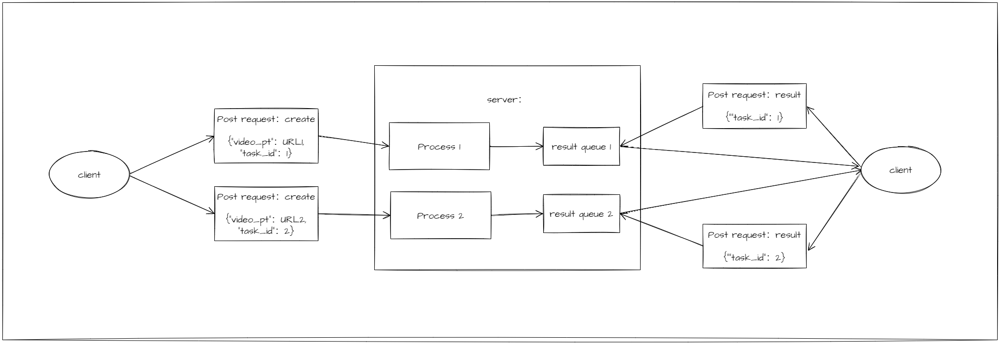

# yolov5_http
基于sophon sdk的yolov5 python例程，支持http请求的响应。

## 例程目录
```bash
├── README.md
├── pic                   # README说明中用到的图片 
├── yolov5_client         # client
│   ├── http_create.py    # client发送开始任务的请求
│   ├── http_result.py    # client发送获取结果的请求
│   └── img_with_results  # client获取的结果图
└── yolov5_server         # server
    ├── httpdemo.py       # 本地server
    ├── input             # 本地输入视频
    ├── model             # 模型
    ├── run.sh            # 开启本地server的脚本
    └── yolo              # 算法流程相关
```

## 例程说明



在server启动后，client端可以向server端发送创建任务的请求，提供输入视频的url或地址以及任务的id。server中会启动子进程进行解码预处理推理等过程，将最终画框结果保留在结果队列中。client端后续可以发送获取结果的请求，以获取检测框结果和结果图片，图片已经过base64编码。结果队列的长度可以在httpdemo.py文件中指定，获取结果将一次性获取整个结果队列的内容。

## 例程使用方法

### 1. server

与server相关的部分在yolov5_server目录下

run.sh：
```bash
./run.sh 1    # 开启服务，server相关的输出保存在相同目录下的output.log文件中
./run.sh 0    # 停止服务
```


### 2. client:
在开启server后，可以向server发送post请求。http_create.py用于给server发送创建推理任务的请求，http_result.py用于给server发送获取推理任务结果的请求。

以下是两个文件的传参方式：

```bash
python3 http_create.py --server_url URL --task_id TASKID --input INPUT

参数说明：
    --server_url      server的地址
    --task_id         创建任务的id
    --input           任务的输入，可以是本地视频或者流地址


python3 http_result.py --server_url URL --task_id TASKID

参数说明：
    --server_url      server的地址
    --task_id         创建任务的id

```

传参方式举例：
```bash
python3 http_create.py --server_url http://127.0.0.1:5000/ --task_id 1 --input input/test_car_person_1080P.mp4

python3 http_result.py --server_url http://127.0.0.1:5000/ --task_id 1  # 获取的结果图会保留在相同目录下的img_with_results目录中
```
